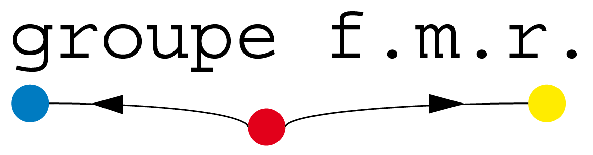

# L'analyse de réseau en sciences sociales. Petit guide pratique
Version 0.1 - Mai 2023

## Description
Version html du pdf disponible à cette adresse https://hal.science/hal-04052709/document.
Si ce petit guide vous est utile, merci de citer la version HAL.

## Contact
Si vous avez des remarques, des questions, des suggestions, des propositions, cf ici : https://groupefmr.hypotheses.org/6189.

## Remerciements
Un grand grand merci à Hugues Pecout et à Kristina Matrosova. Je fais encore des trucs bizarres avec git mais ce n'est pas de votre faute...

## License
Si ce petit vous est utile, merci de le citer. Le reste vous regarde.

## Accès au petit guide pratique
https://beauguitte.github.io/analyse-de-reseau-en-shs/

